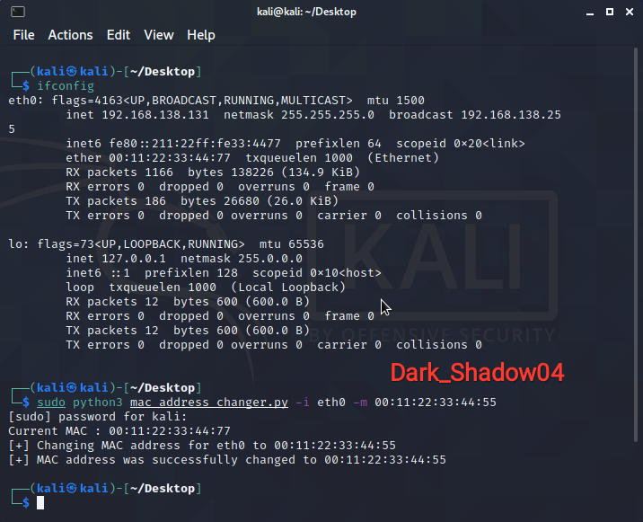

<b><h2> Author             : Dark_Shadow04  
 Github             : https://github.com/DarkShadow04  
 My Blog            : https://arfortech.wordpress.com  <h2>
 Subcribe my blog for Tools, Tricks & Scripts ^_^ </b>

# mac_address_changer
It will change MAC Address of specified port to desired address  

# usage
python3 mac_address_changer.py -i eth0/wlano -m mac-address  
(or)  
sudo python3 mac_address_changer.py -i eth0/wlano -m mac-address  

# example:
python3 mac_address_changer.py -i eth0 -m 00:11:22:33:44:77  
(or)  
sudo python3 mac_address_changer.py -i eth0 -m 00:11:22:33:44:77
